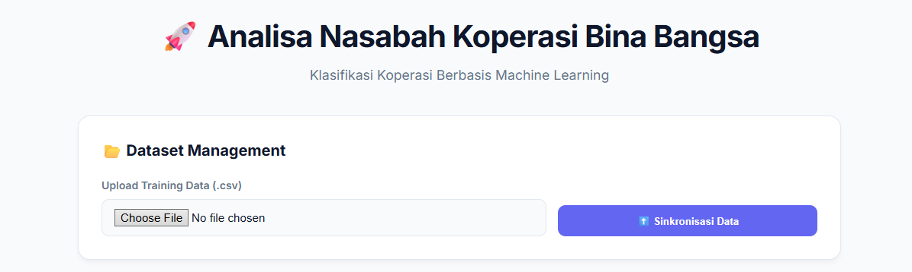
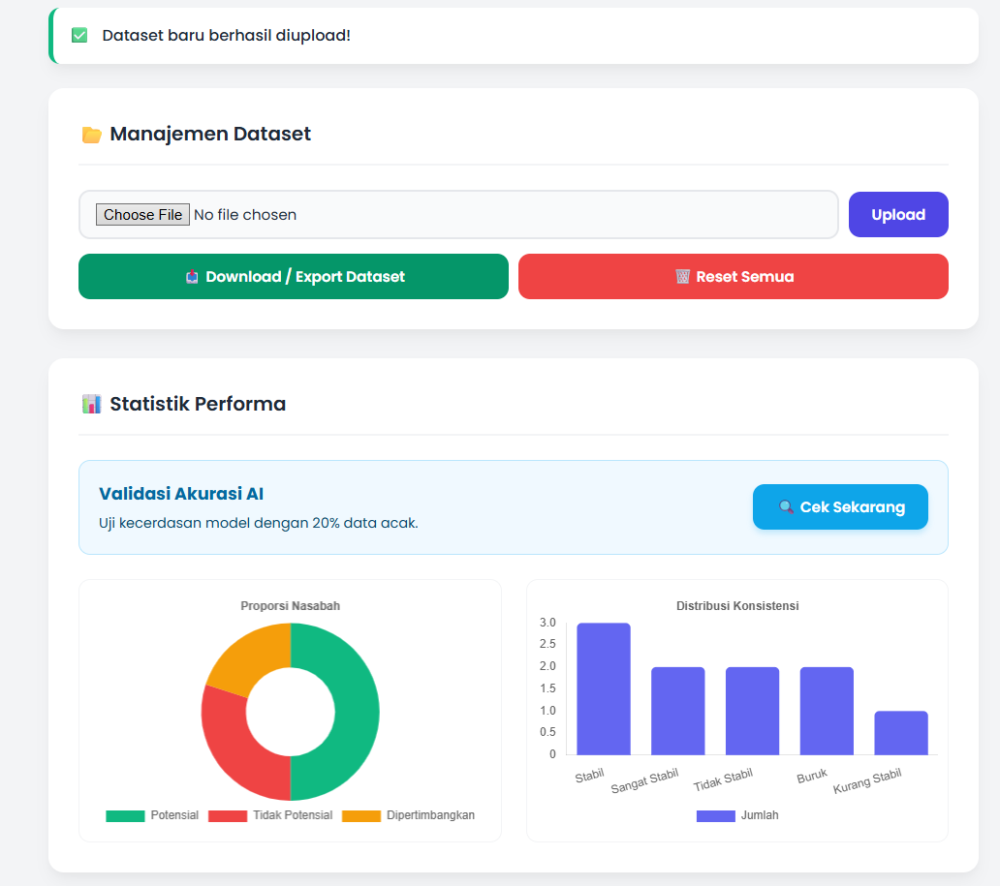
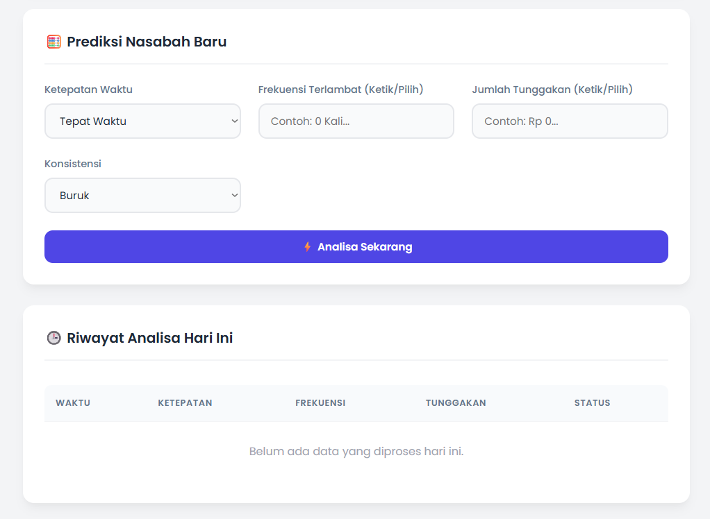
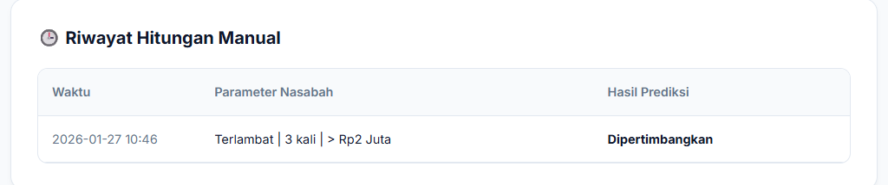
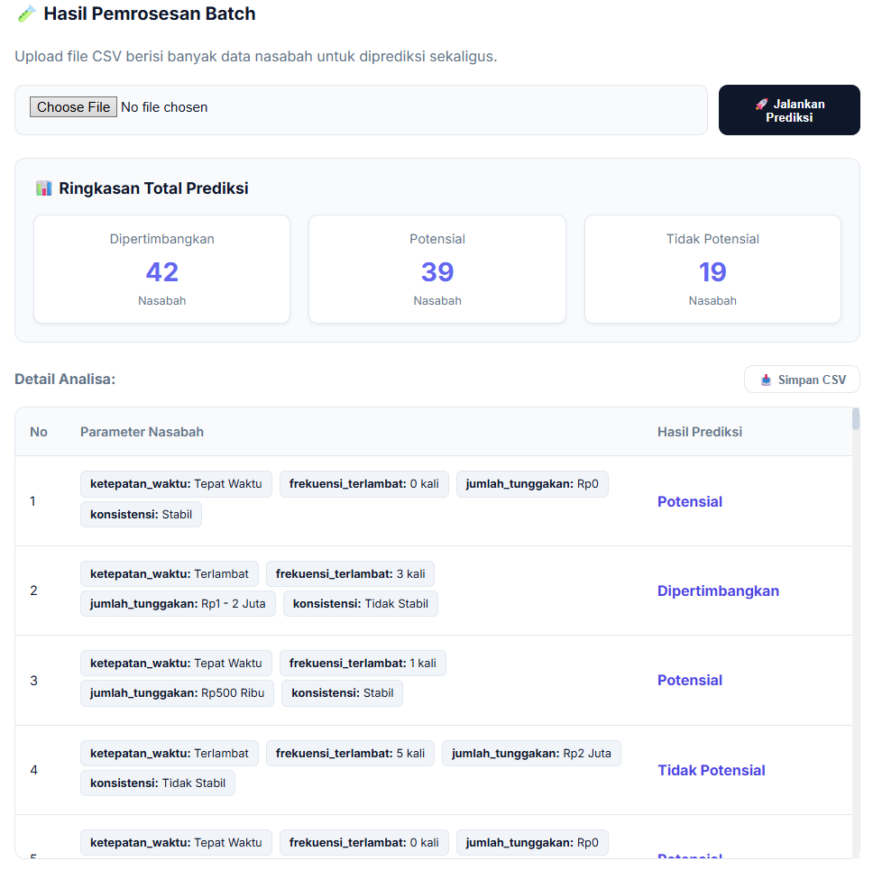

# 🚀 Smart Naïve Bayes: Sistem Klasifikasi Potensi Nasabah (v2.0)


**Smart Naïve Bayes** adalah aplikasi web cerdas untuk memprediksi kelayakan nasabah koperasi (Potensial, Tidak Potensial, atau Dipertimbangkan). Aplikasi ini tidak hanya sekadar kalkulator statistik, tetapi menggabungkan algoritma **Naïve Bayes** dengan **Active Learning**, **Validasi Logika Adaptif**, dan **Visualisasi Data Real-time** untuk keputusan bisnis yang akurat.

---

## 🌟 Fitur Unggulan

| Fitur | Deskripsi |
| :--- | :--- |
| **🧠 The Guardian (Logic Guard)** | **Validasi Cerdas:** Sistem mempelajari sejarah data. Jika nasabah 'Tepat Waktu' tidak pernah terlambat >2 kali, sistem akan menolak input baru yang mengaku 'Tepat Waktu' tapi terlambat 5 kali. Mencegah anomali dan kontradiksi data. |
| **🧪 Batch Processing (Baru!)** | **Efisiensi Tinggi:** Tidak perlu input satu per satu. Upload file CSV berisi ratusan data nasabah, dan sistem akan memprediksi semuanya sekaligus dalam hitungan detik. |
| **📊 Smart Dashboard (Baru!)** | **Visual Insight:** Pantau kesehatan portofolio nasabah melalui *Doughnut Chart* (distribusi kelas) dan *Bar Chart* (konsistensi pembayaran) secara real-time. |
| **🔢 Regex Input Parsing** | **Human-Friendly:** Input data fleksibel. Mengetik `1.5 Juta` atau `Rp 500rb` akan otomatis dikonversi sistem menjadi angka numerik yang valid (`1500000` / `500000`). |
| **🔄 Active Learning** | **Self-Improving AI:** Setiap hasil prediksi manual yang Anda simpan akan masuk ke dataset latih, membuat model semakin pintar dan akurat seiring berjalannya waktu. |

---

## 📖 Panduan Penggunaan (User Guide)

Ikuti langkah mudah berikut untuk menggunakan aplikasi:

### 1️⃣ Manajemen Dataset
* Siapkan file data latih format **.CSV** (Gunakan contoh di folder `File Tambahan`).
* Masuk ke menu **Dataset Management**.
* Klik **"Choose File"** ➡️ **"Sinkronisasi Data"** untuk melatih otak AI.

### 2️⃣ Monitoring Performa
* Cek panel **Akurasi Model** untuk melihat tingkat kepercayaan sistem (%).
* Analisa grafik pada **Distribusi Data** untuk melihat tren nasabah saat ini.

### 3️⃣ Proses Analisa (Multi-Tab)
Gunakan tab navigasi sesuai kebutuhan:
* **🧮 Hitungan Manual:** Untuk input detail satu nasabah. Cocok untuk wawancara atau verifikasi individual. Data bisa langsung disimpan ke dataset.
* **🧪 Hitungan Batch:** Untuk uji massal data baru. Upload CSV nasabah baru, sistem akan memberi label otomatis. Hasil bisa diunduh via tombol **"Simpan CSV"**.

### 4️⃣ Export & Maintenance
* **Download:** Unduh dataset terbaru yang sudah diperkaya hasil *Active Learning*.
* **Reset:** Tombol merah untuk menghapus seluruh memori dan memulai sesi baru dari nol.

---

## 🛠️ Cara Instalasi & Menjalankan (Technical Guide)

Ikuti langkah ini untuk menjalankan aplikasi di komputer lokal (Localhost).

### Prasyarat
Pastikan komputer Anda sudah terinstal **Python 3.x**.

### Langkah-Langkah

1.  **Clone / Download Repository**
    Download source code ini dan ekstrak ke dalam satu folder.

2.  **Install Library**
    Buka terminal/CMD di folder tersebut, lalu jalankan:
    ```bash
    pip install flask pandas
    ```

3.  **Jalankan Aplikasi**
    Ketik perintah berikut di terminal:
    ```bash
    python app.py
    ```

## 📸 Dokumentasi Antarmuka (UI)

Berikut adalah galeri tampilan aplikasi Smart Naïve Bayes v2.0 beserta penjelasan fiturnya:

<p align="center">
  <b>1. Dashboard Utama & Manajemen Dataset</b><br>
  <i>Tampilan awal untuk upload dataset pelatihan dan sinkronisasi sistem.</i><br><br>
  
</p>

<p align="center">
  <b>2. Statistik Data & Self-Diagnostic Model</b><br>
  <i>Visualisasi distribusi data nasabah (Doughnut & Bar Chart) serta fitur uji akurasi model secara real-time.</i><br><br>
  
</p>

<p align="center">
  <b>3. Prediksi Manual dengan Validasi Logika (The Guardian)</b><br>
  <i>Formulir input cerdas yang dilengkapi validasi logika historis dan fitur Active Learning.</i><br><br>
  
</p>

<p align="center">
  <b>4. Riwayat Klasifikasi & Log Aktivitas</b><br>
  <i>Tabel histori untuk memantau hasil prediksi yang telah dilakukan sebelumnya.</i><br><br>
  
</p>

<p align="center">
  <b>5. Fitur Batch Processing (Uji Massal)</b><br>
  <i>Modul baru untuk memproses ratusan data nasabah sekaligus hanya dengan satu file CSV.</i><br><br>
  
</p>